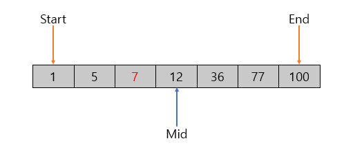
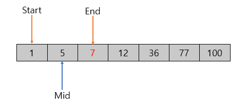
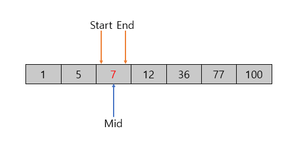
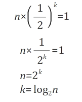
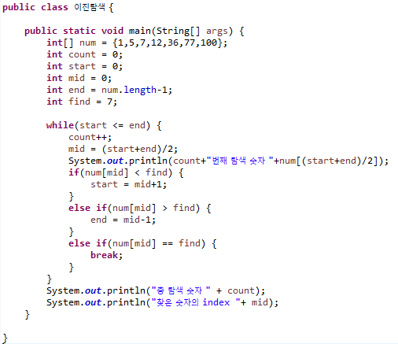
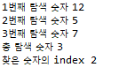

# Binary Search (이진 탐색)

데이터가 정렬된 상태에서 특정한 값을 찾는 탐색.

시작과 끝의 index의 중간값을 값이 찾고자하는 값인지 비교함

ex) {1, 5, 7, 12, 36, 77, 100}에서 7를 찾자!

start = 0

end = 6

mid = (start+end)/2

**1번째**

mid ((0+6)/2 = 3) 번째 원소( 12 )가 찾고자하는 값 7 보다 크다.

—> 12보다 작은 원소들 중고자하는 값이 있다!

—> end index를 원소 12의 mid-1인 2으로 변경 ( {1, 5, 7} 안에 답이 있기 때문 )

**2번째**

mid ((0+2)/2 = 1) 번째 원소 ( 5 )가 찾고자하는 값 7 보다 작다.

—> 5보다 큰 원소들 중에 찾고자하는 값이 있다!

—> start index를 원소 5의 mid+1인 2로 변경 ( { 7 } 안에 답이 있기 때문 )

**3번째**

mid ( (2+2)/2 = 2) 번째 원소 ( 7 )이 찾고자하는 값 7이다.

 

### 시간복잡도 ( O(logN) )

찾는 횟수를 거듭할수록 1이 나올때 까지 N/2로 범위를 줄인다.

### 이진탐색 소스

                      **결과**

