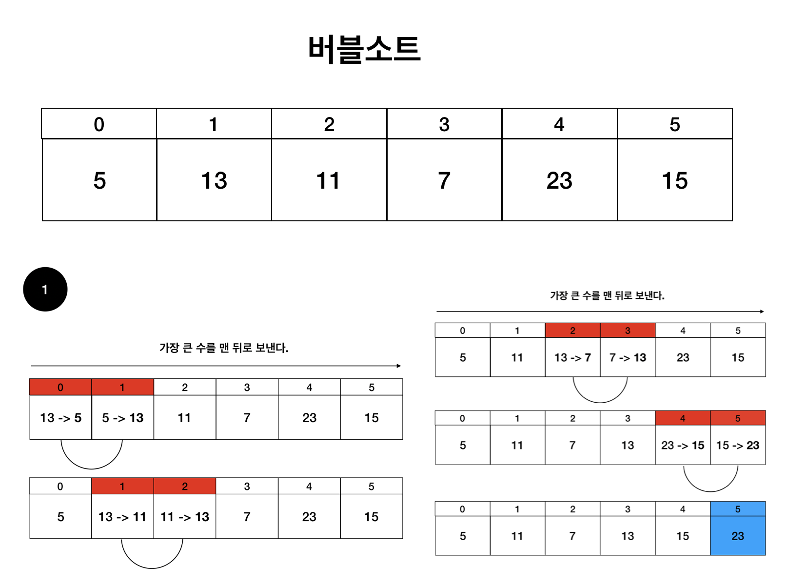
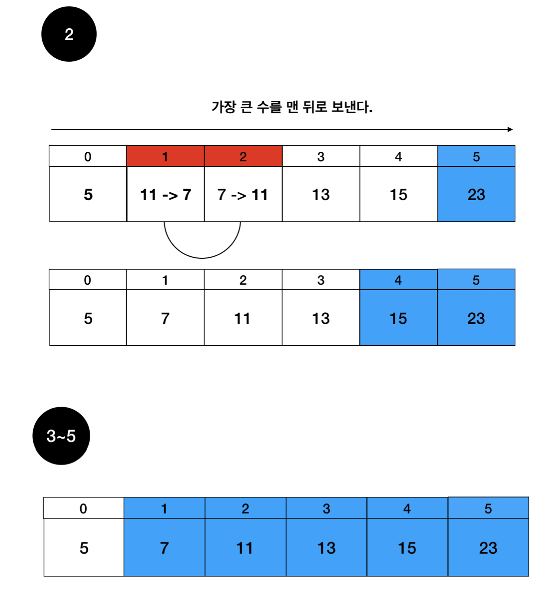

# Bubble sort (버블정렬)

Date: July 6, 2021
핵심: 버블소트

### 버블소트란?

인접한 두 원소를 비교하여 계속해서 가장 큰 수를 맨뒤로 배치하는 정렬

뒷쪽원소가 더 작은수일 때마다 swap을 하기 때문에 선택정렬보다 더 많은 시간이 걸린다.

### 시간복잡도는 O(N^2)

아래에 그림을 보며 이해하는게 좋다.





이처럼 뒤부터 큰 수를 채우는 정렬이다.

```java
public static void main(String[] args) {
		Scanner sc = new Scanner(System.in);
		int N = sc.nextInt();
		int[] num = new int[N];
		
		for(int i = 0; i < N; i++) {
			num[i] = sc.nextInt();
		}
		
		for(Integer n : solution(N, num)) {
			System.out.print(n + " ");
		}
	}

	private static int[] solution(int N, int[] num) {
		for(int i = 0; i < N-1; i++) {
			for(int j = 0; j < N-i-1; j++) {
				if(num[j] > num[j+1]) {
					int temp = num[j+1];
					num[j+1] = num[j];
					num[j] = temp;
				}
			}
		}
		return num;
	}
```

- 첫번째 for문 : 정렬해야하는 원소 갯수 마지막은 할 필요가 없으므로 N-1이다.
- 두번쨰 for문 : 버블소트는 가장 큰 수를 먼저 정렬해주는 것이라고 생각하면 된다.
- 범위가 N - i - 1인 이유는 뒷쪽부터 정렬이 되기 때문에 정렬이 될수록 범위가 작아진다. 또 앞과 뒤를 비교하기 때문에 -1이 추가된다.