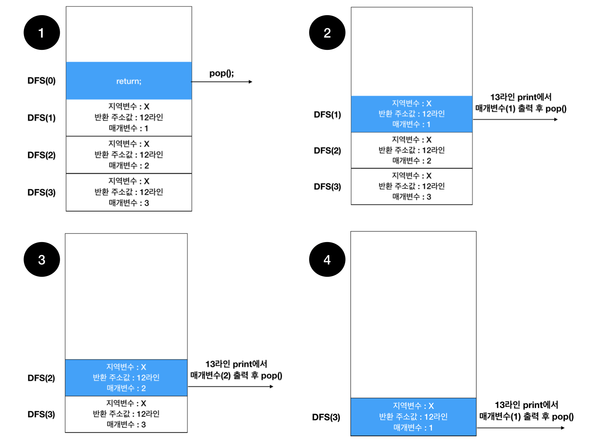

# 재귀함수

재귀함수는 Stack영역 (메모리)을 사용합니다.

실행중이던 함수를 멈추고 자기 자신(메소드)를 호출함으로써, 

종료할때까지 Stack영역에 Stack Frame을 쌓습니다. 

참고 : [Stack Frame](https://github.com/kyustar/TIL/blob/master/%EC%95%8C%EA%B3%A0%EB%A6%AC%EC%A6%98/Stack%20Frame.md) 

```java

public class 재귀함수 {

	public static void main(String[] args) {
		DFS(3);
	}

	private static void DFS(int N) {
		if(N == 0) return;
		else {
			DFS(N-1);
			System.out.print(N + " ");
		}
	}
}
```



이처럼 진행되기 때문에 DFS(3)을 실행하게 되면, "1 2 3" 이 출력된다.

주의! 
-> 출력위치가 DFS(N-1) 위라면 "3 2 1"이 출력된다.
-> Stack의 자료구조 특성상 순차적으로 종료하며 출력을 하게 되면, "1 2 3" (역순)이 나오게 된다.

재귀를 이해하기 위해서는 Stack을 이해해야하기 때문에 간단히 정리해보았다.