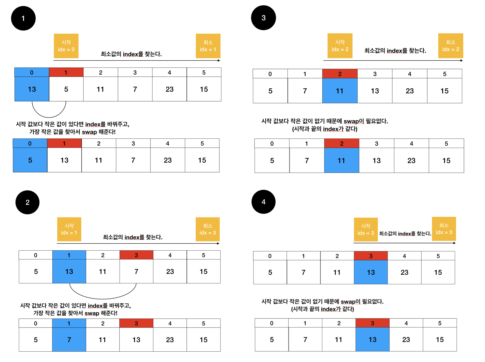
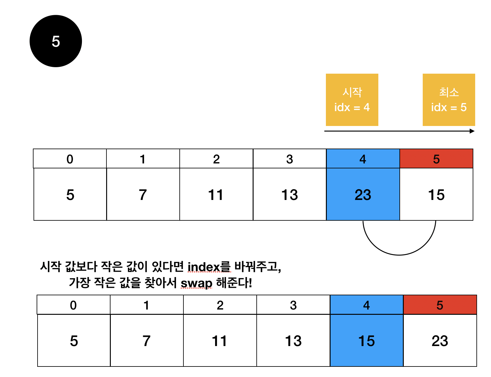

# selection sort (선택정렬)

Date: July 6, 2021
핵심: 선택정렬

### 선택 정렬이란?

기준값을 두고 그 이후에서 가장 작은수를 구하여 swap 하며 정렬을 하는 것이다.

사실상 가장 작은수를 찾아서 맨 앞으로 보내는것이라고 생각할 수 있다.

(N-1번의 기준을 두고 가장 작은수를 swap한다.)

### 시간복잡도는 어쨋든 최소값을 찾으려면 끝까지 반복해야함으로 O(N^2) 이다.

한번 그림으로 설명해보겠다.





이와 같이 최소값을 탐색한뒤, 기준보다 작다면 swap 해준다.

```java
public static void main(String[] args) {
		Scanner sc = new Scanner(System.in);
		int N = sc.nextInt();
		int[] num = new int[N];
		
		for(int i = 0; i < N; i++) {
			num[i] = sc.nextInt();
		}
		
		for(Integer n : solution(N, num)) {
			System.out.print(n + " ");
		}
	}

	private static int[] solution(int N, int[] num) {
		for(int i = 0; i < N-1; i++) {
			int idx = i;
			for(int j = i+1; j < N; j++) {
				if(num[j] < num[idx]) {
					idx = j;
				}
			}
			int temp = num[idx];
			num[idx] = num[i];
			num[i] = temp;
		}
		return num;
	}
```

- 첫 for문 : 기준을 N-1번 만 두면 된다. (마지막은 안해도 정렬이 이미 되기 때문에)
- 현재가 최소값일 수도 있으니, 기준 index를 저장해준다.
- 기준보다 작은 값이 있다면 계속해서 갱신해줘서 최소값의 index를 저장한다.
- swap하여 기준 위치과 최소값의 위치를 바꿔준다.