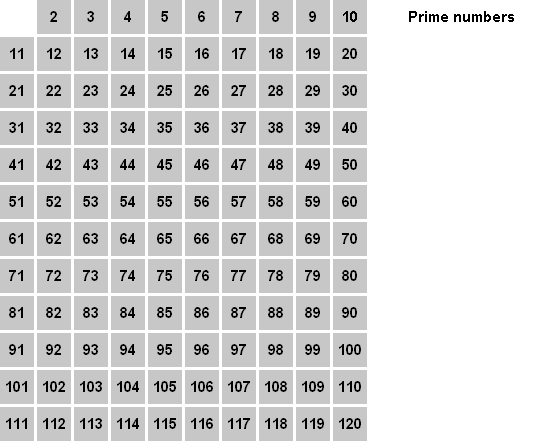
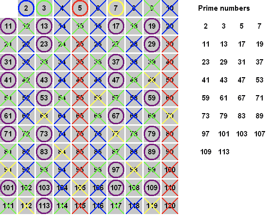
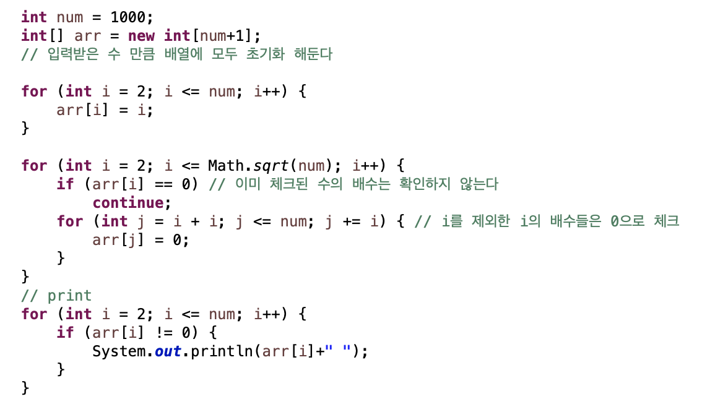

# 에라테스토네스의 체

고대 그리스의 수학자 에라토스테네스가 만들어 낸 소수를 찾는 방법. 이 방법은 마치 체로 치듯이 수를 걸러낸다고 하여 '에라토스테네스의 체'라고 부른다.

## 원리

소수의 배수들을 제거하는 방법을 사용한다.

이와 같이 2~120까지의 수 중에서 소수를 구할때, 제거가 되지않은 수는 소수이고, 이 소수의 배수들을 제거해주는 작업을 진행한다.

### 코드

소수를 찾을때 num의 제곱근만큼만 반복을 진행하면 조금 더 시간을 줄일 수 있다.

제곱근 만큼만 반복하면 되는 이유?
A * B  = C 일 경우, A나 B 둘중 하나는 무조건 C의 제곱근 보다 작기 때문이다.

 ex) 28 = 7 * *4 / 4* * 7 가 된다. 28의 약수가 1, 2, 4, /(제곱근의 위치)/7, 14, 28이라면  28의제곱근은 5와 6사이의 수이다. 그래서 2~5까지만 확인하여도 소수 판별을 할 수 있다.

→ 문제에 1000까지 범위이므로 1000까지의 소수를 판별하고 싶으면 1000의 제곱근 만큼만 확인해도 상관없다.