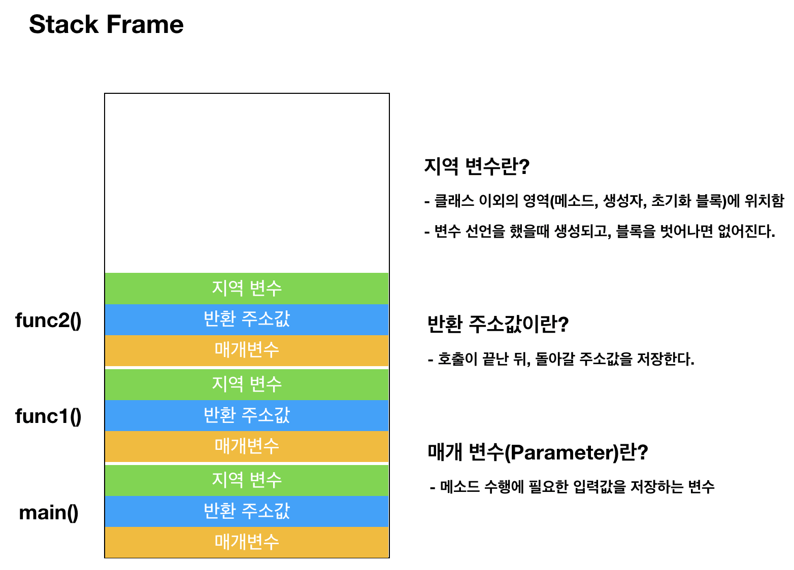

# Stack Frame

메모리의 스택(stack) 영역은 함수의 호출과 관계되는 지역 변수와 매개변수가 저장되는 영역입니다.

스택 영역은 함수의 호출과 함께 할당되며, 함수의 호출이 완료되면 소멸합니다.

함수가 호출되면 스택에는 

- 함수의 매개변수
- 호출이 끝난 뒤 돌아갈 반환 주소값
- 함수에서 선언된 지역 변수 등이 저장됩니다.

이렇게 스택 영역에 차례대로 저장되는 함수의 호출 정보를 스택 프레임(stack frame)이라고 합니다.

```java
int main(void){
    func1();  // func1() 호출
    return 0;
}

void func1(){
    func2();  // func2() 호출
}

void func2(){
}
```



위 코드를 실행하면 이와 같이 스택에 쌓이고, 블럭이 종료되면 pop() 됩니다.

Stack Frame을 이해하면 재귀를 이해하는데 큰 도움이 되기 때문에 기억해두는게 좋습니다.