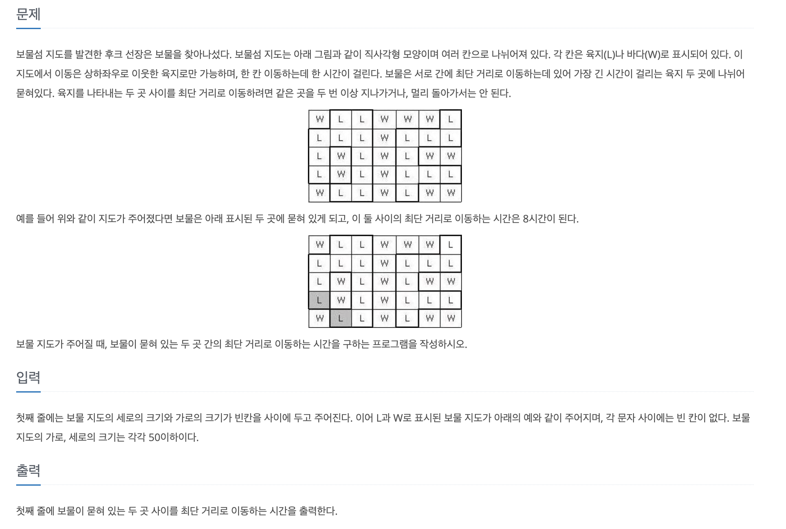

# 2589_보물섬

Date: March 25, 2021
Tags: 백준
문제링크: https://www.acmicpc.net/problem/2589
핵심: BFS



이 문제의 핵심은 모든 'L'의 좌표에서 최단거리로 이동했을때 가장 먼 값을 구하는 것이다.

최단거리는 BFS로 움직일때마다 주변에 0인 수를 1씩 올려주면서 값을 넣어주면되고, 그중에서 가장 큰 값을 따로 저장해주어야한다.

1. 우선 L의 좌표를 저장하는 Queue를 생성해야한다. 그리고 L좌표를 저장한 Queue에서 좌표를 받아 거기서 bfs를 돌려준다. 물론 check배열과 timeCount배열은 bfs를 돌려주기전에 초기화 해줘야한다.

```java
import java.io.BufferedReader;
import java.io.IOException;
import java.io.InputStreamReader;
import java.util.Arrays;
import java.util.LinkedList;
import java.util.Queue;
import java.util.StringTokenizer;

public class Main {

	static int N,M;
	static char[][] map;
	static int[][] countMap;
	static boolean[][] check;
	static Queue<Point> landPoint = new LinkedList<>();
	static Queue<Point> saveLandPoint = new LinkedList<>();
	static int maxTime = Integer.MIN_VALUE;
	static int[] dy = {0,1,0,-1};
	static int[] dx = {1,0,-1,0};
	public static void main(String[] args) throws IOException {
		BufferedReader br = new BufferedReader(new InputStreamReader(System.in));
		StringTokenizer st = new StringTokenizer(br.readLine());
		N = Integer.parseInt(st.nextToken());
		M = Integer.parseInt(st.nextToken());
		map = new char[N][M];
		for (int i = 0; i < N; i++) {
			String input = br.readLine();
			for (int j = 0; j < M; j++) {
				map[i][j] = input.charAt(j);
				if(map[i][j] == 'L') {
					saveLandPoint.add(new Point(i, j, 0));
				}
			}
		}
		while(!saveLandPoint.isEmpty()) {
			countMap = new int[N][M];
			check = new boolean[N][M];
			Point p = saveLandPoint.poll();
			check[p.y][p.x] = true;
			landPoint.add(p);
			bfs();
		}
		System.out.println(maxTime);
	}
	private static void bfs() {
		while(!landPoint.isEmpty()) {
			Point p = landPoint.poll();
			if(maxTime < p.time) {
				maxTime = p.time;
			}
			for (int d = 0; d < 4; d++) {
				int newY = p.y + dy[d];
				int newX = p.x + dx[d];
				if(save(newY, newX) && map[newY][newX] == 'L' && !check[newY][newX] && countMap[newY][newX] == 0) {
					check[newY][newX] = true;
					countMap[newY][newX] = p.time+1;
					landPoint.add(new Point(newY, newX, p.time+1));
				}
			}
		}
	}
	private static boolean save(int newY, int newX) {
		return newY >= 0 && newX >= 0 && newY < N && newX < M;
	}
	static class Point{
		int y;
		int x;
		int time;
		public Point(int y, int x, int time) {
			this.y = y;
			this.x = x;
			this.time = time;
		}
	}
}
```

처음 코딩할때 너무 배열 선언이 많아서 줄일 방법이 없는지 고민을 많이 했다. countMap을 check배열처럼 쓸려고 생각해봤다. 하지만 처음 시작점이 0으로 되어있는 것을 1로 바꿔주고, 마지막 maxTime부분에서 -1을 해준다면, 읽는사람 입장에서는 왜 1로 시작하고 마지막에 -1을 해줬는지에 대해서 의문이 들 것 같아서 따로 check배열을 만들었다. 

아직 알고리즘을 짤 때 변수명은 신경쓰고 있지만, 함수로 분리하는 부분은 익숙치 않다. 알고리즘을 풀때도 클린코드를 유지하도록 노력해야겠다.

### 결과

### 메모리 : 292168 KB / 속도 : 516 ms