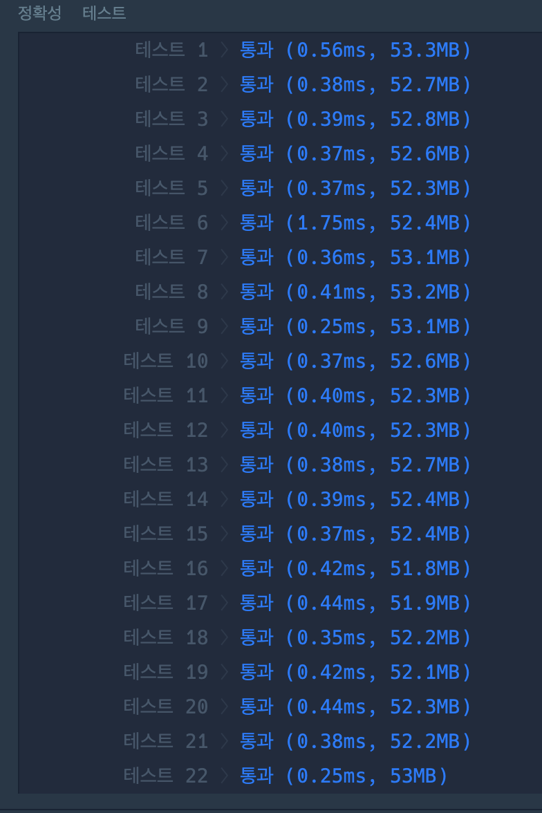

# 거리두기 확인하기

Date: July 11, 2021
Tags: 프로그래머스
문제링크: https://programmers.co.kr/learn/courses/30/lessons/81302
핵심: bfs

거리두기 조건에 맞춰 배치가 됐는지 확인하는 문제이다. 맨하튼거리를 활용하여 2이상이 나오면 거리두기 유지가 되지 않는것인데, 대부분 사람들이 모든경우를 따로 코드로 짜주면서 문제를 풀었다.

그러나, 자세히 보면 bfs로 1번 이하로 움직이고 사람을 만난다면 거리두기를 유지하지 못한다.

반대로 bfs로 2번 이상 움직인다면 무조건 그사람은 거리두기를 유지한것으로 간주할 수 있다.

```java
import java.util.*;
class Solution {
  static int[] dy = {0,1,0,-1};
	static int[] dx = {1,0,-1,0};
	static char[][] place = new char[5][5];
	static int[] result = new int[5];
  public int[] solution(String[][] places) {
    for(int i = 0; i < 5; i++) {
			for(int j = 0; j < 5; j++) {
				String str = places[i][j]; 
				place[j] = str.toCharArray();
			}
			boolean flag = true;
			loop : for(int y = 0; y < 5; y++) {
				for(int x = 0; x < 5; x++) {
					if(place[y][x] == 'P') {
						if(!bfs(y,x)) {
							flag = false;
							break loop;
						}
						
					}
				}
			}
			if(flag) {
				result[i] = 1;
			}
			else {
				result[i] = 0;
			}
		}
		return result;
	}
	
	private static boolean bfs(int y, int x) {
		boolean[][] check = new boolean[5][5];
		Queue<Point> q = new LinkedList<>();
		check[y][x] = true;
		q.add(new Point(y,x,0));

		while(!q.isEmpty()) {
			Point p = q.poll();
			if(p.tableCnt >= 2) {
				break;
			}
			for(int d = 0; d < 4; d++) {
				int newY = p.y + dy[d];
				int newX = p.x + dx[d];
				if(safe(newY, newX) && !check[newY][newX]) {
					if(place[newY][newX] == 'P' && p.tableCnt <= 1) {
						return false;
					}
					else if(place[newY][newX] == 'O'){
						check[newY][newX] = true;
						q.add(new Point(newY, newX, p.tableCnt+1));
					}
				}
			}
		}
		return true;
	}

	private static boolean safe(int newY, int newX) {
		return newY >= 0 && newY < 5 && newX >= 0 && newX < 5;
	}

	static class Point{
		int y;
		int x;
		int tableCnt;
		public Point(int y, int x, int tableCnt) {
			this.y = y;
			this.x = x;
			this.tableCnt = tableCnt;
		}
	}
}
```

- 첫번째 어려웠던점 : 5행5열의 주어진 places의 하나의 원소인 문자열의 길이도 5이다.

→  place[j] = places[i][j].toCharArray()를 해주어야 하나의 char가 place에 들어가게 된다. 5*5*5라서 처음 이것을 파악하는게 헷깔렸다.

- 이동이 가능한 좌표와 가능하지 않은 좌표를 구분하는 일...

→  

(1). 사실상 O를 만났을 때는 무조건 이동시켜준다.

(2). P를 만났을 때 tableCnt(이동) 수를 확인해준다. (2이상이면 true, 1이하이면 false)

(3). X는 굳이 따로 경우를 살펴볼 필요가 없다.



전체를 캡처하지는 못하여지만, 다들 빠른속도임을 알 수 있다. (P일때마다 최대 3번 Queue에 들어간다.)

다른분들의 코드도 보았지만, 아직은 모든경우를 다 구현하는 코드보다는 좋은 코드라고 생각한다.