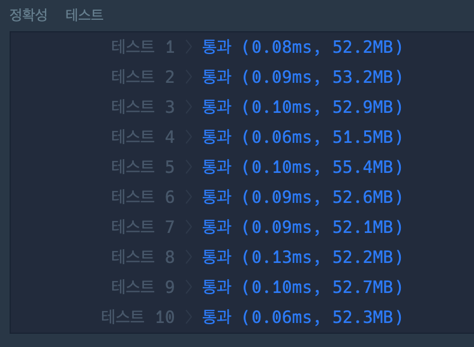
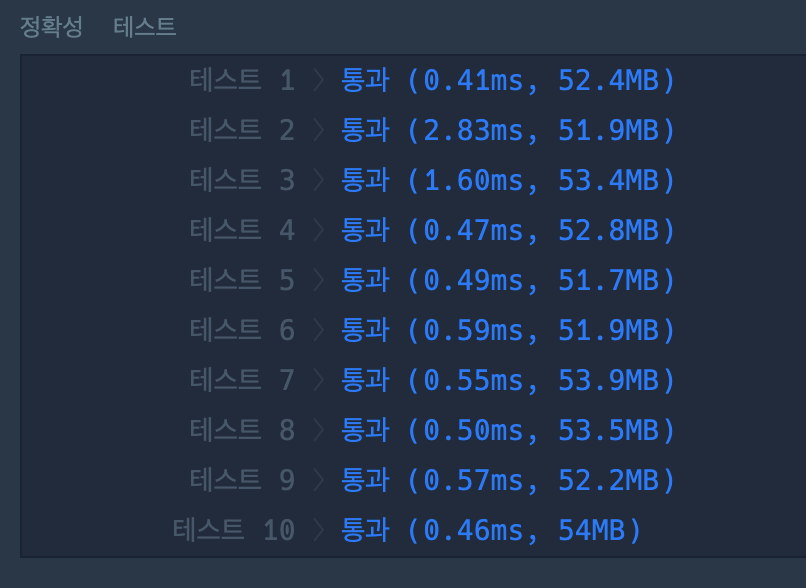

# 숫자 문자열과 영단어

Date: July 9, 2021
Tags: 프로그래머스
문제링크: https://programmers.co.kr/learn/courses/30/lessons/81301
핵심: HashMap, replaceAll

카카오2021 채용형인턴은 코딩테스트를 통과했던 시험이였지만, 다시 한번 복기하고자 풀어보았다.

문자열이 주어지고, 영어로 숫자를 표현한 부분을 숫자로 변환해야한다.

ex) one2seven9 → 1279

1. 처음에는 캐릭터를 계속 더하면서 확인하는것을 생각했는데, 문자열을 비교하는 부분이 그렇게 성능적으로 좋을것 같지 않아서, HashMap을 써서 푸는것으로 생각했다.

```java
import java.util.*;
class Solution {
    public int solution(String s) {
        HashMap<String, Integer> strToNum = new HashMap<>();
		strToNum.put("zero", 0);
		strToNum.put("one", 1);
		strToNum.put("two", 2);
		strToNum.put("three", 3);
		strToNum.put("four", 4);
		strToNum.put("five", 5);
		strToNum.put("six", 6);
		strToNum.put("seven", 7);
		strToNum.put("eight", 8);
		strToNum.put("nine", 9);
		
		StringBuilder result = new StringBuilder();
		StringBuilder sb = new StringBuilder();
		for(char c : s.toCharArray()) {
			if(c >= '0' && c <= '9') {
				result.append(c);
			}
			else {
				sb.append(c);
				if(strToNum.containsKey(sb.toString())) {
					result.append(strToNum.get(sb.toString()));
					sb = new StringBuilder();
				}
			}
		}
		return Integer.parseInt(result.toString());
	}
}
```



HashMap을 썼을때, 속도가 굉장히 빠른것을 알 수 있다.

2. 두번째는 다른사람의 풀이를 봤는데, 굉장히 코드가 간결하여서 따라해보았다. replaceAll을 이용하여 전체 문자열에서 숫자로 변경하는 작업이였다.

```java
import java.util.*;

class Solution {
    public int solution(String s) {
        int answer = 0;
        StringBuilder sb = new StringBuilder("");
        int len = s.length();
        String[] digits = {"0","1","2","3","4","5","6","7","8","9"};
        String[] alphabets = {"zero","one","two","three","four","five","six","seven","eight","nine"};

        for(int i=0; i<10; i++){
            s = s.replaceAll(alphabets[i],digits[i]);
        }

        return Integer.parseInt(s);
    }
}
```



—> 속도 측면에서는  HashMap이 월등히 좋지만, 코드가 굉장히 간결하다.