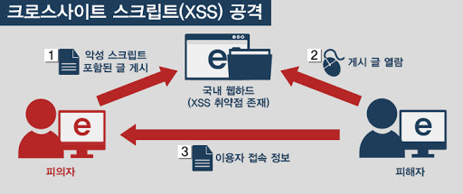
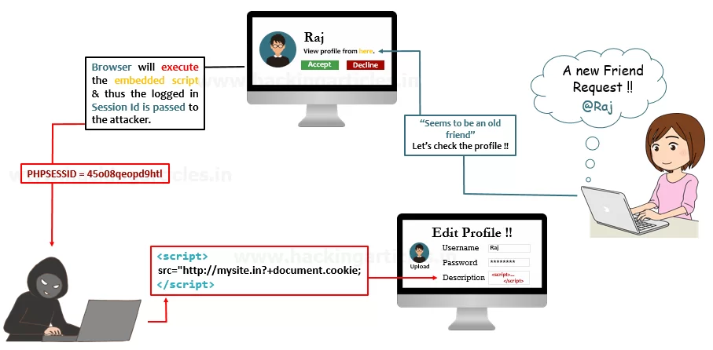

# XSS(Cross Site Scripting) 공격이란?

프로젝트를 정리하면서 JWT(Json Web Token)에 대해서 다시 살펴보았다.

토큰의 Stateless한 성질을 활용하여 session으로 저장하지 않는다는 것이 마냥 좋다고 생각하고 있었다.

 하지만, 문득 분명 session으로 저장할때보다는 서버에 부담이 가지않음이 확실한데, JWT의 단점은 무엇일까? 라는 의문이 들었다. 그래서 JWT을 활용함으로써 생기는 보안적 문제점인 XSS에 대해서 알아보겠다.

### XSS란?

→ XSS는 Cross Site Scripting, 즉 웹 애플리케이션에서 일어나는 취약점으로 관리자가 아닌 권한이 없는 사용자가 웹 사이트에 스크립트를 삽입하는 공격 기법이다.

**(XSS는 입력한 일반 문자가 HTML 코드로 인식되어 발생한다.)**

### 공격에 의해 어떤 결과가 나타날까?

→ 공격에 성공하면 사이트에 접속한 사용자는 삽입된 코드를 실행하게 되며, 보통 의도치 않은 행동을 수행시키거나 쿠키나 세션 토큰 등의 민감한 정보를 탈취한다.

### XSS 공격 과정?

출처 : [https://kr-codingmonkey.github.io/STUDY/Web_Hacking/8_Cross_site_Scripting.html](https://kr-codingmonkey.github.io/STUDY/Web_Hacking/8_Cross_site_Scripting.html)

- 가짜 페이지를 생성하고, 사용자 입력을 유도, 정보를 탈취
- 사용자 브라우저에 저장된 정보를 탈취

### 어떻게 Script를 삽입할까?

출처 : [https://cisoclub.ru/rukovodstvo-po-osushhestvleniyu-cross-site-scripting-xss/](https://cisoclub.ru/rukovodstvo-po-osushhestvleniyu-cross-site-scripting-xss/)

→ 게시판과 같은 form에 스크립트를 삽입한다.

### XSS 공격 종류

- Reflected XSS

    - 스크립트를 입력하면 바로 반사되어 바로 실행이 되는 방법

    - 보통 Reflected XSS 는 공격자가 악의적인 스크립트와 함께 URL을 사용자에게 누르도록 유도하고, URL을 누른 사용자는 악의적인 스크립트가 실행되면서 공격을 당하게 됩니다.

- Stored XSS

    - 스크립트를 저장해뒀다가 공격하는 방법

    - 보통 Reflected XSS 는 공격자가 악의적인 스크립트와 함께 URL을 사용자에게 누르도록 유도하고, URL을 누른 사용자는 악의적인 스크립트가 실행되면서 공격을 당하게 됩니다.

### JWT은 어떻게 탈취당하는거야?

→ 주로 토큰은 LocalStorage에 저장하는데, LocalStorage는 스크립트를 사용하여 정보를 가져올 수 있다.

### 방어 방법?

- 입력필터

    - 자바는 적당한 XSS 필터를 만든 뒤, web.xml에 선언하여 모든 파라미터가 해당 필터를 거치도록 하는것 만으로도 좋은 효과를 볼 수 있다.

    - PHP는 입력을 처리할 때, 정규식을 이용하는 preg_replace를 사용하거나, 노드를 이용하는 DOMDocument를 사용할 수 있다.

- 출력필터

    - HTML5부터 iframe의 sandbox 옵션으로 iframe 내의 자바스크립트, 폼과 같은 것의 제한이 가능해 졌으므로, 위의 방법을 실행한 뒤 2차적으로 써보는 것도 좋다.

- 쿠키의 보안 옵션 사용

    - 쿠키 생성시 '보안 쿠키'라는 파라미터를 지정하면 TLS 상에서만 사용하게 할 수 있으며, 'HTTP ONLY'라는 파라미터로 웹 브라우저상에서만 쓸 수 있게 할 수도 있다.\

출처 : [https://namu.wiki/w/XSS](https://namu.wiki/w/XSS)