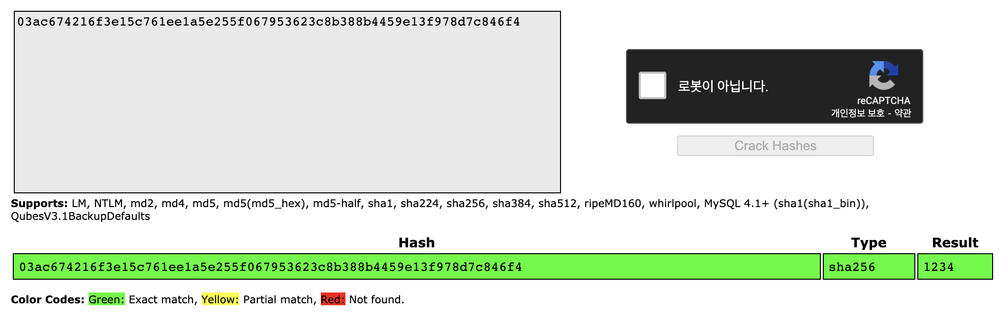

# 단방향 해시 보완법

단반향 해시의 가장 큰 특성은 해싱이 이루어지면 해독이 불가능한 것이다.

(양방향 해시는 암호화, 복호화가 가능!)

ex) "1234"를 단방향 해쉬 알고리즘인 SHA-256으로 해싱이 이루어지면 → "03ac674216f3e15c761ee1a5e255f067953623c8b388b4459e13f978d7c846f4" 이라는 Digest가 나온다. (해싱을하면 64자리의 16진수가 나온다. → 32Byte)

이와 같은 성질때문에 단방향 해시는 비밀번호를 저장할때 많이 사용한다. (평문 저장 X)

**그렇다면 어떤 문제점이 생기고, 이를 어떻게 보안해야할까??**

### 문제점

- 같은 문자열로 SHA-256으로 해싱을하면 같은 해싱값이 나온다!
- 다시말하자면, Rainbow Table을 통해 평문을 유추할 수 있다.

    Rainbow Table이란?

    → 해시 함수를 사용하여 변환 가능한 모든 해시 값을 저장시켜 놓은 표

    

    (이렇게 해싱값으로 문자를 유추하는 사이트도 있다.)

### 보완법

(1). 키 스트레칭 (해싱값(Digest)을 여러번 해싱하는것)

→ "03ac674216f3e15c761ee1a5e255f067953623c8b388b4459e13f978d7c846f4" (원본 : 1234)를 한번 더 해싱하면 "756bc47cb5215dc3329ca7e1f7be33a2dad68990bb94b76d90aa07f4e44a233a" 값이 나온다.

이처럼 여러번 해싱을 거쳐서 원본을 추적하기 힘들게 만드는 것이다.

(2). Salt값

→ 여러번 해싱을 거치더라도 횟수별 Rainbow Table에서 내 원문을 찾을수도 있다. 그래서 나온 방법이 Salt이다. (Salt값을 원본에 소금을쳐 다른 값으로 만든 뒤 해싱을 하는것이다.)

→ "1234"(원문) + "siajcins123"(Salt)를 합하여 해싱을 한다.

→ 사용자들이 같은 비밀번호를 설정하더라도 salt값이 다르므로 다른 해싱값이 나온다.

이처럼 키 스트레칭과 Salt값을 혼용하면 더 좋은 암호가 될 수 있다.